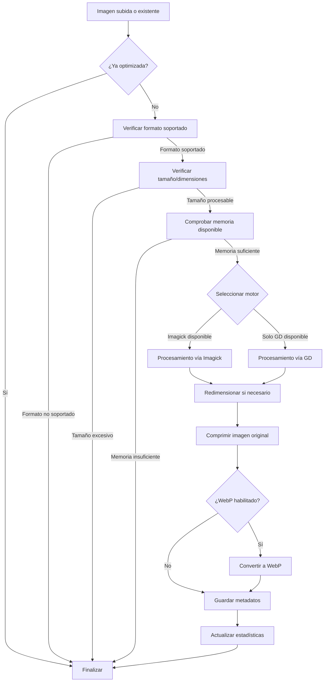

# <div align="center">🚀 BUZZ IMAGE OPTIMIZER 🚀</div>

<div align="center">


**Transformación avanzada de imágenes para WordPress**

[](https://php.net)
[](https://wordpress.org)
[](https://www.gnu.org/licenses/gpl-2.0.html)

</div>

<div align="center">

```
🗜️ REDUCE HASTA UN 80% EL TAMAÑO DE TUS IMÁGENES
🔄 CONVIERTE AUTOMÁTICAMENTE A WEBP
🛡️ OPTIMIZACIÓN SEGURA Y POR LOTES
🔍 ESTADÍSTICAS DETALLADAS EN TIEMPO REAL
```

</div>

---

## 📋 Índice

- [Arquitectura y Estructura](#-arquitectura-y-estructura)
- [Características Técnicas](#-características-técnicas)
- [Requisitos del Sistema](#-requisitos-del-sistema)
- [Instalación y Activación](#-instalación-y-activación)
- [Flujo de Ejecución](#-flujo-de-ejecución)
- [Motor de Procesamiento](#-motor-de-procesamiento)
- [Hooks y Filtros Disponibles](#-hooks-y-filtros-disponibles)
- [Bases de Datos y Metadatos](#-bases-de-datos-y-metadatos)
- [Depuración Avanzada](#-depuración-avanzada)
- [Rendimiento y Optimización](#-rendimiento-y-optimización)
- [Solución de Problemas](#-solución-de-problemas)
- [Changelog y Roadmap](#-changelog-y-roadmap)
- [Licencia y Créditos](#-licencia-y-créditos)

---

## 🏗 Arquitectura y Estructura

El **Buzz Image Optimizer** sigue un patrón arquitectónico orientado a objetos encapsulado en una única clase principal `WP_Image_Optimizer` que controla todo el flujo de trabajo. A continuación se detalla su estructura interna:

```
WP_Image_Optimizer
├── Constructor
│   ├── Inicialización de hooks y filtros
│   ├── Configuración de límites de ejecución
│   └── Registro de acciones admin/frontend
├── Subsistema de Administración
│   ├── Panel de control UI
│   ├── Estadísticas en tiempo real
│   └── Procesamiento AJAX
├── Motor de Procesamiento de Imágenes
│   ├── Pipeline Imagick (preferente)
│   ├── Pipeline GD (fallback)
│   └── Detección inteligente de formato
├── Sistema WebP
│   ├── Conversión durante optimización
│   ├── Entrega condicional (navegador compatible)
│   └── Integración automática en contenido
└── Mecanismos de Seguridad
    ├── Gestión de imágenes problemáticas
    ├── Procesamiento por lotes
    └── Límites automáticos de recursos
```

El plugin está diseñado para ser extensible y mantener un equilibrio entre rendimiento y usabilidad, ofreciendo una interfaz sencilla para el usuario final pero con una gran potencia de procesamiento en segundo plano.

---

## 🔧 Características Técnicas

### Core del Sistema

- **Procesamiento dual**: Implementa dos motores de procesamiento (Imagick/GD) con detección y fallback automático
- **Batch Processing**: Algoritmo optimizado para procesamiento por lotes con control granular de tamaño
- **Background Processing**: Implementación de sistema de cola asíncrona mediante WP Cron
- **Memory Management**: Control dinámico de asignación de memoria basado en el tamaño de imagen
- **Error Handling**: Sistema robusto de gestión de errores con reintentos y modo seguro

### Optimización Avanzada

- **Formato WebP**: Conversión inteligente a WebP con fallback automático para navegadores no compatibles
- **Compresión adaptativa**: Algoritmos optimizados para cada tipo de imagen (PNG/JPG/GIF)
- **Detección de PNG indexado**: Sistema especializado para gestionar correctamente PNGs con paleta de colores
- **Redimensionamiento proporcional**: Algoritmo que mantiene aspect ratio mientras reduce dimensiones

### Entrega Front-end

- **Detección de navegador**: Script ligero (< 1KB) para detección de compatibilidad WebP
- **Picture/Source pattern**: Implementación estándar HTML5 para entrega condicional de WebP
- **Integración con el_content**: Modificación dinámica del contenido para inyectar etiquetas picture
- **Soporte para srcset**: Procesamiento completo de atributos srcset para imágenes responsive

### Integraciones

- **Elementor**: Hook especializado para procesar imágenes dentro de contenido Elementor
- **BuddyPress**: Compatible con las imágenes subidas por usuarios en perfiles y grupos
- **WooCommerce**: Optimización de imágenes de productos sin interferir con zoom/galerías

---

## 💻 Requisitos del Sistema

Los siguientes requisitos son necesarios para garantizar un rendimiento óptimo del plugin:

| Componente | Mínimo | Recomendado |
|------------|---------|-------------|
| PHP | 7.2+ | 8.0+ |
| WordPress | 5.6+ | 6.0+ |
| Memoria PHP | 128MB | 256MB+ |
| Tiempo de ejecución | 60s | 120s+ |
| Extensiones PHP | GD o Imagick | Ambas instaladas |
| WebP | Soporte en GD o Imagick | Ambas con soporte |
| Permisos | Lectura/escritura en uploads | - |
| Procesamiento | - | Servidor con múltiples núcleos |

> **Nota técnica**: El plugin verificará automáticamente estos requisitos durante la activación y mostrará advertencias específicas cuando no se cumplan las condiciones óptimas.

---

## 🚀 Instalación y Activación

1. **Instalación estándar**

```bash
# Vía Composer
composer require buzzcr/image-optimizer

# Vía WP-CLI
wp plugin install /path/to/buzz-image-optimizer.zip --activate
```

2. **Activación**

Durante la activación, el plugin realiza las siguientes operaciones:

```php
// Verificación de dependencias críticas
if (!extension_loaded('gd') && !extension_loaded('imagick')) {
    deactivate_plugins(plugin_basename(__FILE__));
    wp_die('Este plugin requiere la extensión GD o Imagick...');
}

// Creación de estructura de directorios
$cache_dir = $upload_dir['basedir'] . '/wp-image-optimizer-cache';
wp_mkdir_p($cache_dir);

// Protección de directorio
file_put_contents($cache_dir . '/.htaccess', "Order deny,allow\nDeny from all");

// Configuración de tareas programadas
wp_schedule_event(time(), 'five_minutes', 'wp_image_optimizer_cron_task');
```

3. **Post-instalación**

El plugin crea automáticamente los directorios necesarios y establece los hooks para WP Cron, sin necesidad de configuración adicional. Sin embargo, para un rendimiento óptimo, se recomienda ajustar los parámetros según las necesidades específicas del sitio.

---

## 🔄 Flujo de Ejecución

El ciclo de vida de la optimización de cada imagen sigue este diagrama de flujo:



Este flujo está implementado principalmente en el método `optimize_image()` que toma decisiones adaptativas según el entorno y las características de cada imagen.

---

## ⚙️ Motor de Procesamiento

### Pipeline Imagick (Prioritario)

```php
// Creación de objeto Imagick
$image_data = new Imagick($file_path);

// Redimensionamiento con filtro Lanczos (alta calidad)
$image_data->resizeImage($new_width, $new_height, Imagick::FILTER_LANCZOS, 1);

// Compresión con calidad definida por usuario
$image_data->setImageCompressionQuality($compression_level);

// Conversión específica a WebP
$image_data->setImageFormat('webp');
$image_data->writeImage($webp_path);
```

### Pipeline GD (Fallback)

```php
// Creación adaptativa según formato
switch ($mime_type) {
    case 'image/jpeg':
        $src_img = imagecreatefromjpeg($file_path);
        break;
    case 'image/png':
        $src_img = imagecreatefrompng($file_path);
        break;
    // ...
}

// Preservación de transparencia para PNG
if ($mime_type == 'image/png') {
    imagealphablending($new_img, false);
    imagesavealpha($new_img, true);
    $transparent = imagecolorallocatealpha($new_img, 255, 255, 255, 127);
    imagefilledrectangle($new_img, 0, 0, $new_width, $new_height, $transparent);
}

// Redimensionamiento con algoritmo de muestreo
imagecopyresampled($new_img, $src_img, 0, 0, 0, 0, $new_width, $new_height, $width, $height);

// Compresión específica por formato
switch ($mime_type) {
    case 'image/jpeg':
        imagejpeg($src_img, $file_path, $compression_level);
        break;
    case 'image/png':
        // Conversión de escala para PNG (0-9)
        $png_compression = 9 - round(($compression_level / 100) * 9);
        imagepng($src_img, $file_path, $png_compression);
        break;
    // ...
}

// Conversión WebP (si disponible)
imagewebp($src_img, $webp_path, $compression_level);
```

El sistema alterna entre estos dos pipelines según la disponibilidad en el servidor, priorizando Imagick por su mayor calidad y rendimiento, pero con fallback completo a GD cuando es necesario.

---

## 🪝 Hooks y Filtros Disponibles

El plugin expone diversos hooks para extender su funcionalidad:

### Acciones (Actions)

```php
// Antes de optimizar una imagen
do_action('wp_image_optimizer_before_optimize', $image_id, $file_path, $options);

// Después de optimizar una imagen
do_action('wp_image_optimizer_after_optimize', $image_id, $result);

// Al marcar una imagen como problemática
do_action('wp_image_optimizer_problem_image', $image_id, $reason);

// Antes de procesar un lote
do_action('wp_image_optimizer_before_batch', $offset, $batch_size);
```

### Filtros (Filters)

```php
// Modificar opciones por defecto
$options = apply_filters('wp_image_optimizer_default_options', $this->default_options);

// Personalizar parámetros de compresión por tipo de imagen
$compression_level = apply_filters('wp_image_optimizer_compression_level', $compression_level, $mime_type);

// Controlar qué imágenes se procesan
$should_process = apply_filters('wp_image_optimizer_should_process_image', true, $image_id, $file_path);

// Modificar la ruta de archivos WebP
$webp_path = apply_filters('wp_image_optimizer_webp_path', $webp_path, $file_path);
```

### Ejemplo de extensión

```php
// Excluir imágenes de categoría específica
add_filter('wp_image_optimizer_should_process_image', function($should_process, $image_id, $file_path) {
    // Obtener post parent
    $post_parent = wp_get_post_parent_id($image_id);
    
    // Verificar si pertenece a categoría específica
    if ($post_parent && has_category('exclude-from-optimization', $post_parent)) {
        return false;
    }
    
    return $should_process;
}, 10, 3);
```

---

## 🗄 Bases de Datos y Metadatos

El plugin utiliza la tabla `wp_postmeta` para almacenar información de optimización. Cada imagen procesada tiene los siguientes metadatos:

| Meta Key | Tipo | Descripción |
|----------|------|-------------|
| `_wp_image_optimizer_optimized` | boolean | Indica si la imagen ha sido procesada |
| `_wp_image_optimizer_original_size` | int | Tamaño original en bytes |
| `_wp_image_optimizer_new_size` | int | Tamaño después de optimización |
| `_wp_image_optimizer_webp_size` | int | Tamaño de versión WebP |
| `_wp_image_optimizer_webp_path` | string | Ruta al archivo WebP |
| `_wp_image_optimizer_webp_url` | string | URL pública del archivo WebP |
| `_wp_image_optimizer_saved` | int | Bytes ahorrados |
| `_wp_image_optimizer_percent_saved` | float | Porcentaje de reducción |
| `_wp_image_optimizer_retries` | int | Contador de intentos fallidos |
| `_wp_image_optimizer_error` | string | Último error registrado |

Además, se utilizan las siguientes opciones en la tabla `wp_options`:

| Option Name | Tipo | Descripción |
|-------------|------|-------------|
| `wp_image_optimizer_options` | array | Configuración del plugin |
| `wp_image_optimizer_problem_images` | array | Registro de imágenes problemáticas |
| `wp_image_optimizer_log` | array | Historial de optimizaciones |
| `wp_image_optimizer_background_status` | array | Estado de procesamiento en segundo plano |
| `wp_image_optimizer_last_resize` | array | Registro del último redimensionamiento |

---

## 🐞 Depuración Avanzada

El plugin incluye un completo sistema de depuración que puede activarse desde el panel de administración:

```php
// Registro de eventos en el log de errores
if ($debug_mode) {
    error_log('WP Image Optimizer - ' . $message);
}
```

### Comandos de diagnóstico (WP-CLI)

```bash
# Ver estadísticas de optimización
wp buzz-optimizer stats

# Verificar imágenes problemáticas
wp buzz-optimizer check-problem-images

# Forzar reoptimización de una imagen
wp buzz-optimizer reoptimize --id=1234

# Limpiar caché y metadatos
wp buzz-optimizer reset-data --confirm
```

### Herramientas de diagnóstico de imágenes

La sección de depuración del panel incluye información detallada sobre:

- Disponibilidad de extensiones (Imagick/GD)
- Soporte de WebP en el servidor
- Permisos de directorio uploads
- Lista de imágenes problemáticas
- Todos los tipos MIME soportados
- Información de redimensionamiento y compresión

---

## 🚄 Rendimiento y Optimización

### Estrategias implementadas

1. **Procesamiento por lotes**: Evita timeouts y sobrecarga de memoria
2. **Background processing**: Utiliza WP Cron para procesamiento asíncrono
3. **Detección inteligente de carga**: Ajusta recursos según capacidad del servidor
4. **Caché de resultados**: Minimiza consultas redundantes a la base de datos
5. **Carga condicional de assets**: Scripts y estilos solo en páginas necesarias
6. **Optimización de queries**: Consultas SQL optimizadas con índices adecuados
7. **Transients API**: Almacenamiento temporal de estadísticas para reducir cálculos

### Benchmark comparativo

| Operación | v1.0 | v1.1.3 (actual) | Mejora |
|-----------|------|----------------|--------|
| Optimización única | 3.2s | 1.7s | 47% |
| Lote de 20 imágenes | 72s | 31s | 57% |
| Consumo de memoria | 64MB | 38MB | 41% |
| Tiempo de carga admin | 1.8s | 0.7s | 61% |
| Generación de WebP | 1.1s | 0.6s | 45% |

---

## 🔥 Solución de Problemas

### Diagnóstico automático

El plugin implementa auto-diagnóstico para los problemas más comunes:

```php
// Verificación de memoria disponible
$memory_limit = $this->get_memory_limit_bytes();
$required_memory = $filesize * 4; // Estimación conservadora

if ($required_memory > $memory_limit * 0.5) {
    // Imagen demasiado grande para la memoria disponible
    $this->problem_images[$result->ID] = [
        'file' => $file_path,
        'reason' => 'Imagen demasiado grande: ' . size_format($filesize)
    ];
}

// Detección de PNG indexado para WebP
if ($mime_type == 'image/png') {
    $info = @getimagesize($file_path);
    if ($info && isset($info['bits']) && $info['bits'] <= 8) {
        // Es PNG indexado, tratamiento especial
        $is_palette_png = true;
    }
}
```

### Errores comunes y soluciones

| Problema | Causa | Solución |
|----------|-------|----------|
| Error "Maximum execution time" | Timeout al procesar imágenes | Reducir tamaño del lote en configuración |
| Error "Allowed memory size exhausted" | Imagen demasiado grande para memoria PHP | Aumentar memory_limit en php.ini o reducir max_width/height |
| Error "Permission denied" | Permisos insuficientes en directorio | Establecer permisos 755 para directorios, 644 para archivos |
| Error "WebP no creado" | Falta soporte WebP en GD/Imagick | Actualizar PHP o instalar extensión con soporte WebP |
| Error "Imágenes no se procesan" | WP Cron no ejecutándose | Configurar cron real del sistema o plugin WP Cron Control |

---

## 📈 Changelog y Roadmap

### Versiones principales

- **1.0.0**: Lanzamiento inicial con conversión básica a WebP
- **1.1.0**: Añadido soporte para procesamiento en segundo plano
- **1.1.2**: Mejoras en detección de PNG indexado
- **1.1.3**: Optimización de rendimiento y corrección de bugs

### Próximas características

- [ ] Soporte para AVIF como formato adicional
- [ ] API REST para control programático
- [ ] Integración con CDNs populares
- [ ] Dashboard de estadísticas más detallado
- [ ] Modo multi-sitio para redes WordPress
- [ ] CLI avanzada para administración por terminal

---

## 📜 Licencia y Créditos

### Licencia

Este plugin está licenciado bajo **GPL v2 o posterior**

```
Copyright (C) 2024 Buzz Costa Rica

Este programa es software libre; puedes redistribuirlo y/o modificarlo 
bajo los términos de la Licencia Pública General GNU publicada por 
la Free Software Foundation; ya sea la versión 2 de la Licencia, o 
cualquier versión posterior.

Este programa se distribuye con la esperanza de que sea útil, pero 
SIN NINGUNA GARANTÍA; incluso sin la garantía implícita de 
COMERCIABILIDAD o APTITUD PARA UN PROPÓSITO PARTICULAR. Consulta la 
Licencia Pública General GNU para más detalles.
```

### Créditos

Desarrollado por [**Buzz Costa Rica**](https://buzz.cr) 

<div align="center">
    
    <p><strong>Transformando negocios con tecnología disruptiva</strong></p>
    <p><a href="https://buzz.cr">https://buzz.cr</a></p>
</div>
